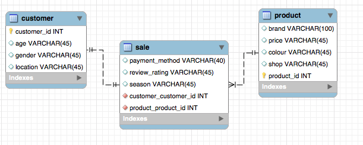
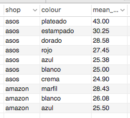

# The Color Currency: <br/> Decoding the Most Expensive Hue (1)

### `ETL project` to investigate the relation between the colour of the women t-shirt clothes and its price in `Amazon.es` and `ASOS.es`


## 1. Extract data  <br/> 
* Scrap Amazon.es using `Selenium` module (.pkl)
    [1.amz1_womentshirt_extract](notebooks/1.amz1_womentshirt_extract.ipynb)
* Use ASOS `API` (.pkl)
    [2.API_ASOS_extract](notebooks/2.API_ASOS_extract.ipynb)
* Download `Kaggle` DDBB (.csv)
    [3.kaggle_extract_transform](notebooks/3.kaggle_extract_transform.ipynb)

## 2. Transform data

Apply the usual methods to filter the relevant data and transform it to acomodate the info in the DDBB.

The most noteworthy challenges when transforming the data were: <br/> 
`Amazon data:` To identify irrelevant cells and normalize of price labels <br/>
`ASOS data:` To normalize the color classification <br/>

* [4.amz1_womentshirt_transform](notebooks/4.amz1_womentshirt_transform.ipynb) <br/>
* [5.API_ASOS_transform](notebooks/5.API_ASOS_transform.ipynb) <br/>
* [6.transform_load](notebooks/6.transform_load.ipynb) <br/>


## 3. Load data to mySQL

* Generate the DDBB EER Diagram on `mySQL Workbench`.
* Load the data using `SqlAlchemy` 



## 4. Make queries to get answers

```
SELECT product.shop, product.colour,  round(avg(product.price),2) AS mean_price <br/>
    FROM product<br/>
LEFT JOIN sale<br/>
    ON  product.product_id = sale.product_product_id <br/>
GROUP BY  product.shop, product.colour<br/>
ORDER BY mean_price DESC<br/>
LIMIT 10;<br/>
<br/>
```


## 5. Exploratory Data Analysis (EDA) and Visualization project

The continuation of this project is available at:

**https://github.com/maluque/EDA_VIZ_project**


## Links of interest:

Data sources: <br/>
[Amazon Spain](https://www.amazon.es/) <br/>
[ASOS Spain](https://www.asos.com/es/) <br/>

Data extraction methods: <br/>
[Rapid API](https://rapidapi.com/) <br/>
[Selenium](https://www.selenium.dev/) <br/>

DDBB Management software: <br/>
[MySQL Workbench](https://www.mysql.com/products/workbench/) <br/>